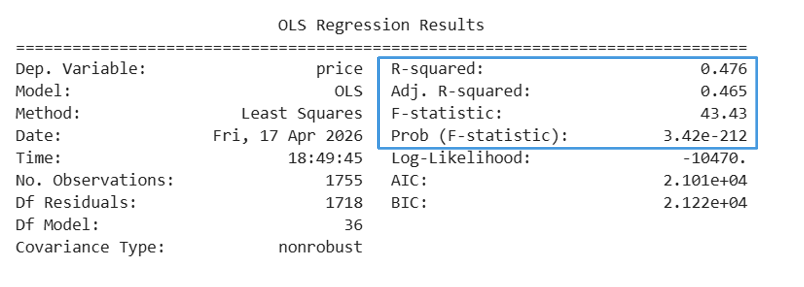
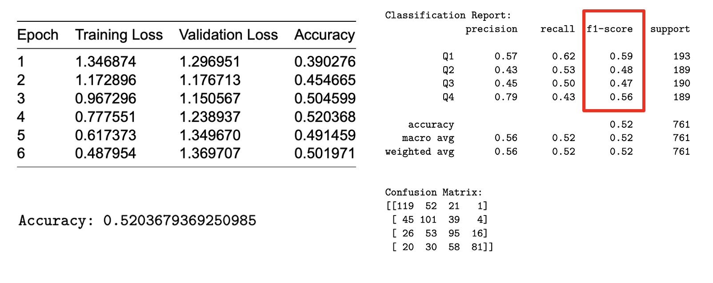
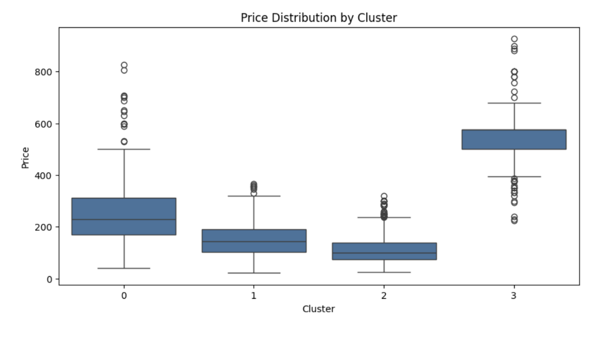
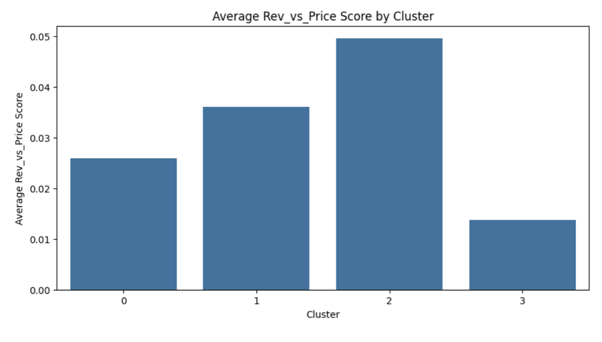

[← Back to Projects](../projects.qmd)

# Airbnb Rentals in Zurich

**Machine Learning & Analytics Project | Boston University**

**Tools:** Python, Pandas, Scikit-learn, Statsmodels, DistilBERT, K-Means Clustering

## Project Overview

For this team project, we analyzed **2,534 Airbnb listings across Zurich** to explore the city's short-term rental market and understand how different listing, location, host, and review characteristics relate to price and other outcomes.

Rather than using one model to answer a single question, we applied several analytical and machine learning techniques to the same dataset. These included exploratory data analysis, multiple regression, K-nearest neighbors, a classification tree, a DistilBERT transformer model, and K-means clustering.

## Project Questions

Our analysis focused on several different questions:

- How do Airbnb listings differ across Zurich's districts?
- Which listing characteristics are associated with price?
- Can listing characteristics predict whether an Airbnb has a workspace?
- Which factors help predict how quickly a host responds?
- Can listing text be used to classify properties into different price ranges?
- Can listings be grouped into meaningful market segments based on their characteristics?

## Data Preparation

The original dataset contained **2,534 listings and 75 variables**. Before modeling, we cleaned the data by addressing missing values, removing irrelevant variables, and preparing features differently depending on the analysis being performed.

For the regression analysis, this also included creating new variables such as host tenure, converting bathroom information into a numerical variable, handling a price outlier, filling missing values with appropriate median or mode values, and creating dummy variables for categorical features.

## Multiple Regression: Understanding Price

One part of the project focused on identifying which listing characteristics were associated with Airbnb prices.

We considered variables related to property size and type, location, availability, minimum stay requirements, host characteristics, reviews, and booking behavior. Backward elimination was then used to refine the regression model.

{width=900}

The final regression model was statistically significant and had an **R² of 0.476**, meaning the model explained approximately 47.6% of the variation in price within the modeling data.

When evaluated separately on validation data, the model achieved:

- **R²:** 0.506
- **RMSE:** 96.30
- **MAE:** 67.07
- **MAPE:** 51.48

Overall, the model showed moderate predictive performance. It captured a meaningful portion of the variation in Airbnb prices, while also showing that other factors affecting price were not fully represented by the available variables.

## Classification Models

We also explored whether listing and host characteristics could be used to predict different types of behavior.

### K-Nearest Neighbors

The K-nearest neighbors model was used to predict whether a listing included a workspace. The target was created from the amenities information, and the model used ten numerical predictors related to price, property size, geography, demand, and host scale.

The final KNN model provided some predictive improvement over the majority-class baseline, although the improvement was modest. It performed better at identifying listings that had a workspace than listings that did not.

### Classification Tree

A classification tree was used to predict **host response time** using host behavior, listing characteristics, demand, and review information.

The tree achieved **73.9% test accuracy compared with a 61.9% baseline**, representing approximately a **12 percentage-point improvement**.

Two variables were especially important: **host acceptance rate** and **host response rate**. Together, they accounted for more than 75% of the model's feature importance, suggesting that existing host behavior was particularly useful for predicting response time.

## DistilBERT: Using Listing Text

To explore unstructured text data, we used **DistilBERT**, a pretrained transformer-based NLP model, to classify listings into four price quartiles.

The model combined text from listing descriptions, host information, and amenities into a single input. After cleaning and tokenizing the text, we fine-tuned DistilBERT to predict whether a listing belonged to price quartile Q1, Q2, Q3, or Q4.

{width=100%}

The model reached its highest validation accuracy at approximately **52%**.

Performance differed across price groups. The model performed particularly well in precision for the highest price quartile, but overall performance showed that text alone could not fully capture the factors that determine Airbnb pricing.

One important limitation was that the transformer only used textual information. Variables such as property size and other structured listing characteristics can be strong indicators of price but were not included in the text-based model.

A possible improvement would be a hybrid approach that combines transformer outputs with structured numerical and categorical variables.

## Market Segmentation with K-Means Clustering

The final part of the project used **K-means clustering** to identify groups of Airbnb listings with similar characteristics.

The clustering analysis used:

- Price
- Number of guests accommodated
- Number of bathrooms
- Annual availability
- Number of reviews
- Review score
- Price per person
- Review value relative to price

After cleaning the data and handling outliers, the variables were standardized and the elbow method was used to determine an appropriate number of clusters.

Four distinct groups emerged:

- **Cluster 0:** Mid-priced, well-rounded listings
- **Cluster 1:** Expensive, larger listings
- **Cluster 2:** Affordable, high-value listings
- **Cluster 3:** Overpriced or inconsistent listings

### Price Differences Between Clusters

{width=850}

The price distributions showed clear differences between the four groups.

**Cluster 2** contained the lowest-priced listings, while **Cluster 3** contained the highest-priced listings. Clusters 0 and 1 represented more moderate price ranges, although Cluster 0 showed greater variation.

## Price vs. Customer Value

Price alone did not tell the entire story, so we also compared the clusters using a review-versus-price measure.

{width=850}

**Cluster 2 had the highest average review-to-price score**, meaning these listings provided strong guest ratings relative to their price.

In contrast, **Cluster 3 had the lowest review-to-price score** despite having the highest prices. This suggested that the higher prices within this segment were not necessarily matched by proportionally stronger guest ratings.

Interestingly, review scores themselves were generally high across all four clusters. This meant that **price and value relative to price were more useful for distinguishing the market segments than review scores alone**.

## Key Findings

Looking across the different parts of the project, several findings stood out:

- Zurich's Airbnb market varies considerably across districts and listing types.
- Listing characteristics explained a meaningful, but incomplete, portion of variation in price.
- Host acceptance and response behavior were strong predictors of host response time.
- Listing text contained useful information about price category, but text alone was not enough to accurately capture all of the factors affecting price.
- Clustering revealed distinct market segments that were not as obvious from individual variables alone.
- The lowest-priced cluster also provided the strongest review value relative to price, while the highest-priced cluster provided the weakest relative value.

## Real-World Applications

Using several models on the same dataset helped show how different analytical methods can answer different questions about the same market.

The results could potentially help:

- **Hosts** better understand pricing and how their listings are positioned within the market.
- **Travelers** identify listings that provide stronger value relative to price.
- **Investors** compare different types of properties and market segments.
- **Platforms** improve recommendation and pricing tools by incorporating both structured listing information and unstructured text.

## Takeaway

The biggest takeaway from this project was that there was no single model that explained the entire Airbnb market. Regression helped us investigate price, classification models explored listing and host behavior, the transformer allowed us to work with unstructured text, and clustering revealed broader market segments.

Working with several approaches on the same dataset also showed me how important it is to choose a method based on the question being asked rather than simply applying the most complex model available.

[← Back to Projects](../projects.qmd)