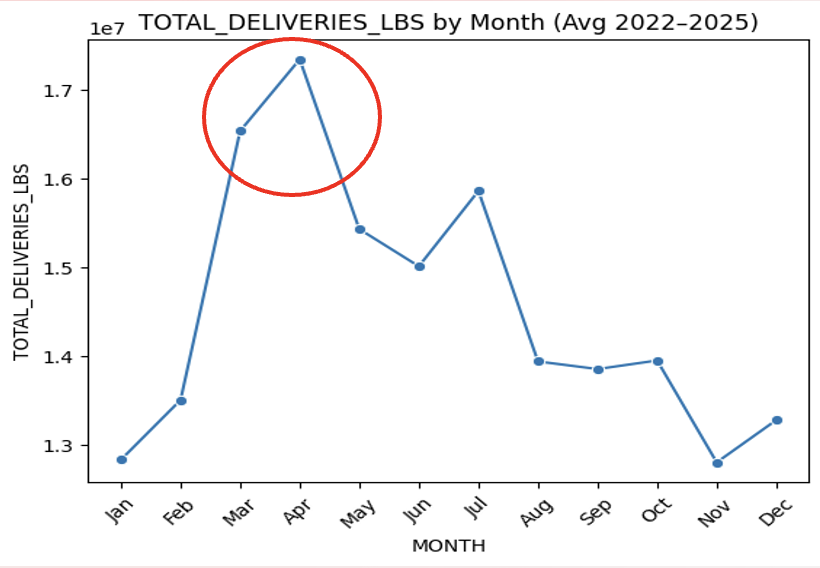
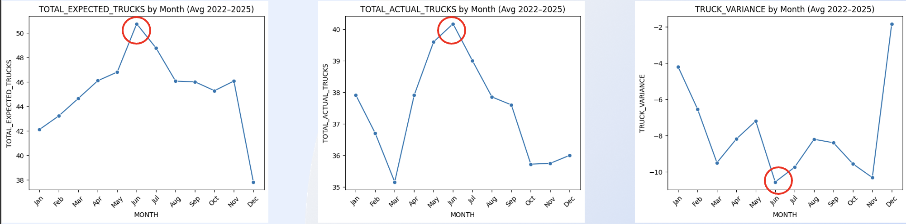
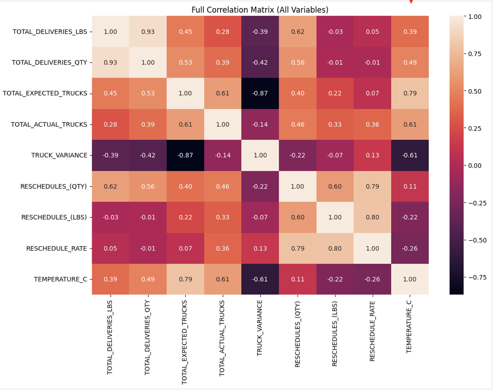
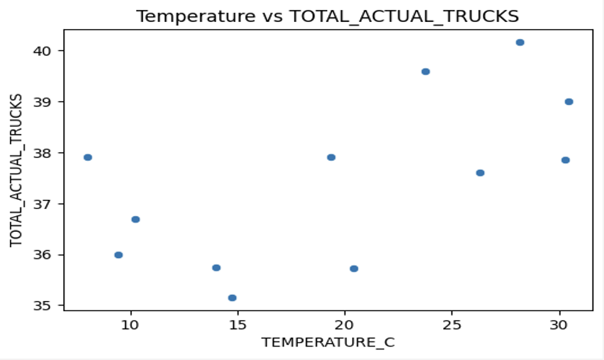
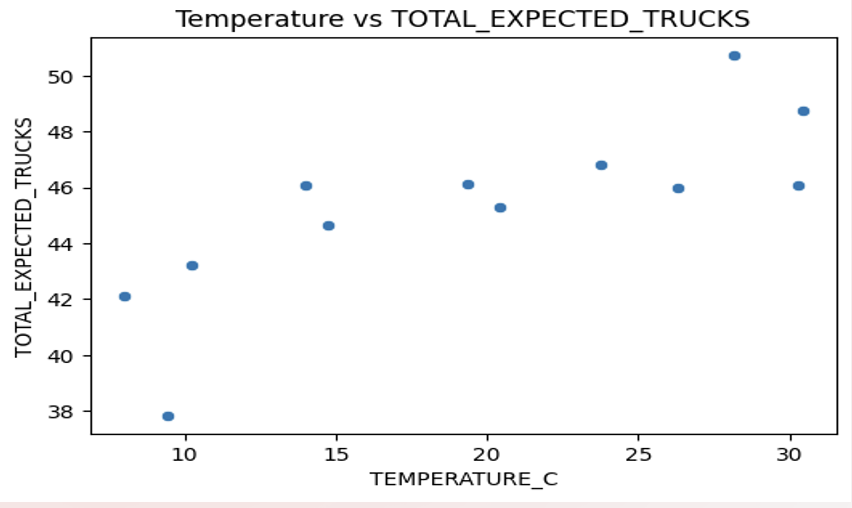

[← Back to Projects](../projects.qmd)

# Delivery Performance Analysis

**Business Intelligence Project | The Build Fellowship, Open Avenues Foundation**

**Tools:** Python, Pandas, Data Visualization, Correlation Analysis

## Project Overview

This project focused on understanding what drives changes in delivery performance and truck capacity. I analyzed delivery operations from 2022–2025 and combined the data with historical temperature patterns from Dallas, Texas to explore whether changes in temperature were related to delivery demand, truck planning, and rescheduling.

The main goal was to separate the effects of seasonal demand from temperature and identify where operational planning could be improved.

## Business Questions

I focused the analysis around three main questions:

- When does delivery demand peak throughout the year?
- How closely does actual truck capacity match expected capacity?
- Does temperature have a meaningful relationship with delivery demand, truck capacity, or rescheduling?

## Delivery Demand

{width=850}

Delivery volume shows a clear seasonal pattern. Average volume increased from approximately **12.8 million pounds in January to 17.3 million pounds in April**, making March and April the busiest period of the year.

After the spring peak, volume generally declined, although there was another increase in July. This pattern suggested that demand was not evenly distributed throughout the year and that capacity planning should account for predictable seasonal changes.

## Truck Capacity

{width=100%}

Comparing expected and actual trucks revealed a consistent capacity gap. Actual truck availability remained below expected truck requirements throughout the year.

The largest shortage occurred around June, when expected trucks reached approximately **50.7** while actual trucks were only around **40.2**. The consistently negative truck variance showed that the operation was regularly working with fewer trucks than expected.

This was important because it showed that the challenge was not simply changing delivery demand. There was also a persistent difference between planned capacity and the resources actually available.

## Relationship Between Operational Variables

{width=900}

I used a correlation matrix to better understand how the operational variables moved together.

Some of the strongest relationships included:

- **Delivery pounds and delivery quantity:** 0.93
- **Expected and actual trucks:** 0.61
- **Temperature and expected trucks:** 0.79
- **Temperature and actual trucks:** 0.61
- **Rescheduled quantity and reschedule rate:** 0.79

One result that stood out was the difference between temperature's relationship with **expected trucks** and its relationship with actual delivery activity. Temperature had a relatively strong relationship with expected truck requirements, but weaker relationships with total delivery pounds (**0.39**) and delivery quantity (**0.49**).

This suggested that temperature and seasonality may be more closely connected to **planning decisions** than to actual delivery demand itself.

## Temperature and Truck Planning

The temperature relationship became clearer when I looked at expected and actual trucks separately.

::: {.grid}

::: {.g-col-12 .g-col-md-6}

### Expected Trucks

{width=100%}

Temperature had a relatively strong positive relationship with expected truck requirements (**r = 0.79**). As average temperatures increased, the number of trucks expected by the operation generally increased as well.

:::

::: {.g-col-12 .g-col-md-6}

### Actual Trucks

{width=100%}

The relationship between temperature and actual trucks was weaker (**r = 0.61**). Actual truck availability varied more and did not increase as consistently with temperature.

:::

:::

Looking at these results together helped distinguish **planning from actual capacity**. Expected truck requirements responded more closely to seasonal temperature patterns, while the number of trucks actually available did not follow those patterns as strongly.

## Key Findings

Overall, the analysis showed that **seasonal demand and capacity constraints were more important drivers of delivery performance than temperature alone**.

- Delivery demand increased significantly during the spring and peaked around March and April.
- Actual truck capacity remained below expected capacity throughout the year.
- Truck shortages continued during periods of high demand and were particularly large around June.
- Higher demand was associated with increased rescheduling.
- Temperature had relatively weak relationships with actual delivery activity.
- Temperature had a stronger relationship with expected truck requirements, suggesting a greater connection to operational planning than to delivery performance itself.

## Business Recommendations

Based on these findings, I identified three areas where operational planning could be improved:

1. **Improve truck allocation during peak spring demand.** March and April consistently showed some of the highest delivery activity, so additional capacity should be planned before the seasonal increase occurs.

2. **Increase capacity planning during periods with larger truck shortages.** The gap between expected and actual trucks was especially noticeable around June, suggesting that expected demand was not always matched by available resources.

3. **Plan around demand patterns rather than temperature alone.** Temperature provides useful seasonal context, but the analysis showed that actual delivery demand and capacity constraints are more important indicators for resource allocation.

## Limitations

There were several limitations to consider when interpreting the results.

The temperature data represented long-term historical averages from **1948–2022**, while the operational delivery data covered **2022–2025**. This required the analysis to assume that more recent temperature patterns were reasonably consistent with historical seasonal averages.

Aggregating the data by month also resulted in only **12 monthly observations**, which limits the depth of statistical analysis that can be performed.

Finally, other factors that could affect delivery performance, such as **labor availability, fuel costs, holidays, and other operational conditions**, were not included in the dataset.

## Takeaway

This project helped me see how an initial question about weather developed into a broader operational finding. Temperature showed some relationship with truck planning, but the larger issue was the mismatch between seasonal demand and available capacity.

The analysis ultimately shifted the focus from simply asking whether weather affects deliveries to identifying **when capacity shortages occur and how historical demand patterns can be used to plan resources more effectively**.

[← Back to Projects](../projects.qmd)